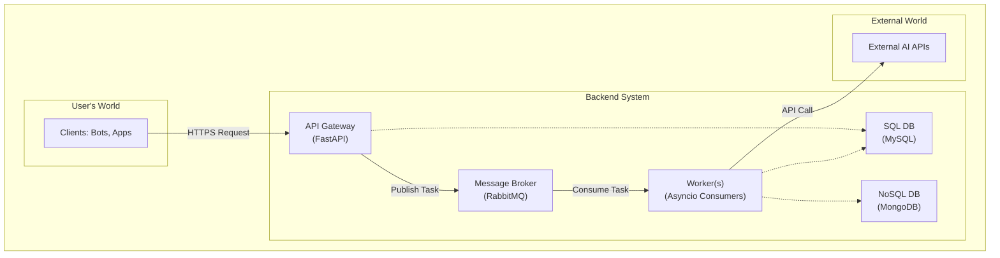

# Axiom AI Gateway

[](https://github.com/your-username/your-repo/actions)
[](https://opensource.org/licenses/MIT)
[](https://www.python.org/downloads/release/python-311/)

> A high-performance, asynchronous API gateway designed to provide unified access to dozens of AI models, featuring a built-in billing, monitoring, and management system.

## 🚀 About The Project

**Axiom AI Gateway** is a production-ready system built to solve the problem of AI service fragmentation. It provides a single, unified API endpoint for interacting with over 20 different AI models (OpenAI, Gemini, etc.), abstracting away the complexity of integration and providing powerful management tools.

This project demonstrates the construction of a complex, asynchronous, and distributed system capable of handling real-world production loads (tested with **30,000+ requests per day**).

## ✨ Key Features

* **Unified API:** A single, consistent interface for dozens of AI models.
* **Reliable Asynchronous Task Processing:** A non-blocking architecture using RabbitMQ and dedicated workers for handling long-running generation tasks.
* **Flexible Billing System:** Built-in balance tracking, custom pricing, and user-specific coefficients.
* **Secure API Key Management:** A robust authentication system.
* **Hybrid Data Storage:** Utilizes both SQL (MySQL) and NoSQL (MongoDB) for optimal data storage and performance.
* **Full-stack Admin Panel:** A comprehensive administrative interface built with Vue.js.
* **Production Ready:** Fully containerized with Docker and Docker Compose for easy and reproducible deployments.

## 🏗️ Architecture

The project is built on a microservice-oriented architecture, where the API server (Producer) and task processors (Consumers/Workers) are decoupled for independent scaling and enhanced reliability.



## 🛠️ Tech Stack


* **Backend:** Python 3.11, FastAPI, SQLAlchemy, Pydantic, AIOHTTP, aio-pika
* **Frontend:** Vue.js
* **Databases:** MySQL, MongoDB, Redis
* **Message Broker:** RabbitMQ
* **DevOps:** Docker, Docker Compose, GitHub Actions (CI)
* **Testing:** Pytest

## ⚙️ Getting Started

To run this project locally, you will need Docker and Docker Compose installed.

### 1. Clone the repository
```bash
git clone [https://github.com/your-username/your-repo.git](https://github.com/your-username/your-repo.git)
cd your-repo
```

### 2. Configure Environment Variables
Copy the example environment file and fill in the required values.
```bash
cp .env.example .env
```
> 🔑 **Important:** Fill the `.env` file with your test keys and configuration details.

### 3. Launch the Project
This single command will build the Docker images and start all the services, including the databases and message broker.
```bash
docker compose up --build
```
After a successful launch, the API will be available at `http://localhost:8000`.

## 📚 API Documentation

Interactive API documentation (Swagger UI and ReDoc) is automatically generated and available at:
* [**http://localhost:8000/docs**](http://localhost:8000/docs) (Swagger UI)
* [**http://localhost:8000/redoc**](http://localhost:8000/redoc) (ReDoc)

Also, a more user-friendly documentation view is available at:
* [**http://localhost:8000/docs/elements**](http://localhost:8000/docs/elements)

## 📄 License

This project is distributed under the MIT License. See the `LICENSE` file for more information.